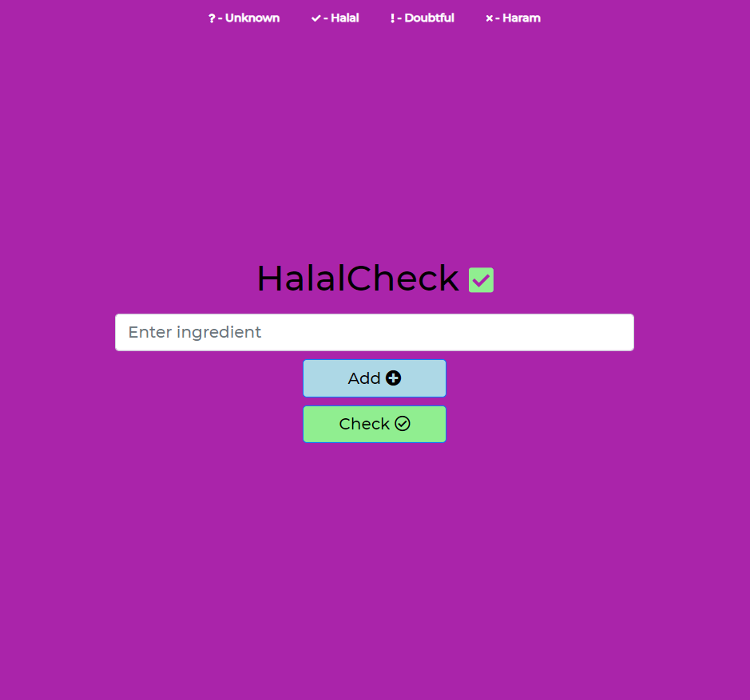
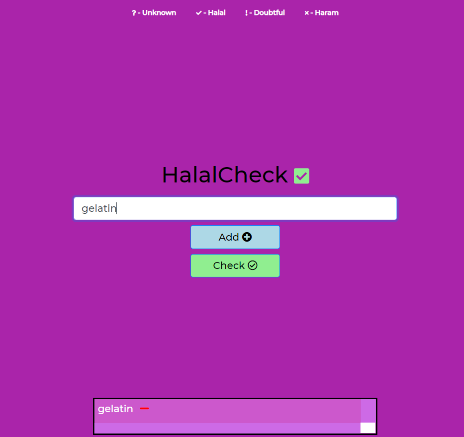
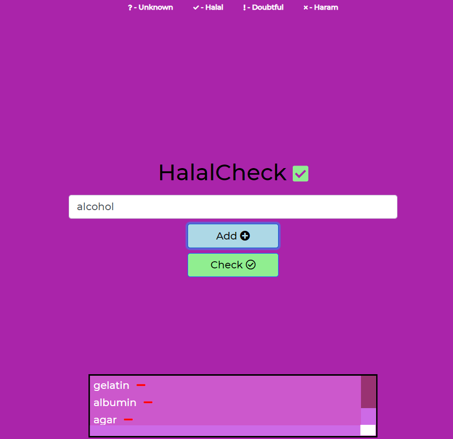
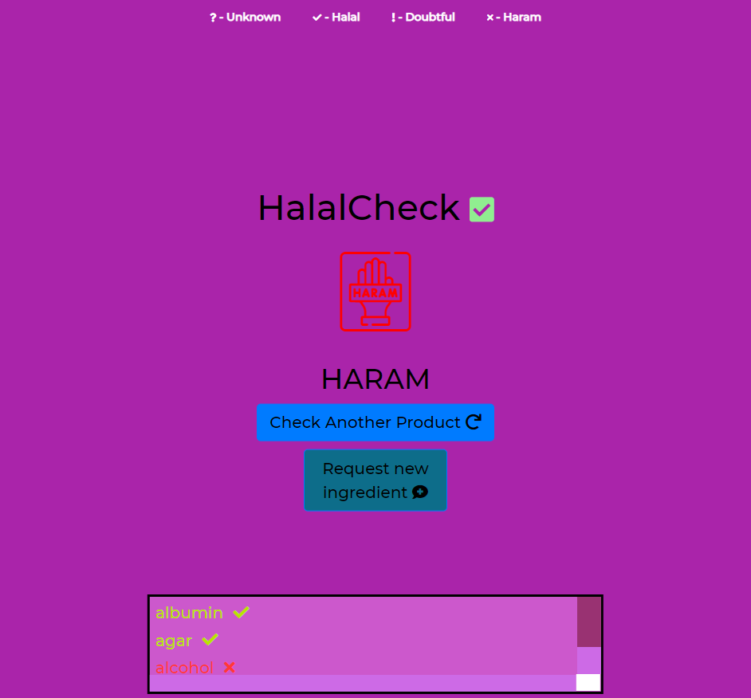

# HalalCheck
A website that finds the Islamic ruling (halal or haram) of food ingredients.

### The website will be available soon on halal-check.herokuapp.com

# Run in dev mode
Download files and run ```node server.js``` or ```nodemon server.js``` in your terminal

# How to use

Enter ingredients in the text box and click the "Add" button to add them to the list.

To remove an ingredient from the list simply click on it

Once you've added all the ingredients click the "Check" button to check the product's validity.


